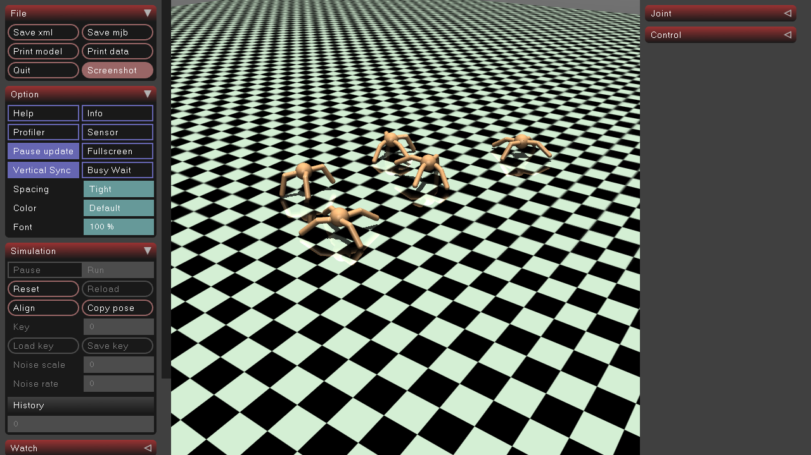

# Brax-to-MuJoCo Ant PPO Pipeline

This project implements a full pipeline to **train an Ant robot using PPO in Brax**, and then **control a real MuJoCo Ant robot using that trained policy**. `ant_sim.gif` shows simulation of ant robot after training.

---

## Project Overview

1. **Simulate ANT via Mujoco Viewer**
2. **Replicate Multiple Environments via a separate function like asked in the Question 2 and can be seen in Mujoco**
3. **Train PPO on Ant in Brax**
4. **Export policy**
5. Ant walks using PPO control in MuJoCo!

---

## Steps to run

1. **Install dependencies**
   
   - Make sure you're using **Python 3.11** on **Windows**.
   - Install required packages:
     
     ```bash
     pip install -r requirements.txt
     ```
2. **Visualize pretrained Ant**
   
   - Simply run the following script to load pretrained PPO parameters and visualize a stable Ant simulation in MuJoCo:
     
     ```bash
     python test.py
     ```
3. **Train PPO from scratch**
   
   - To train a PPO model from scratch, open `trainer.py`.
   - You can configure the training parameters as needed.
   - The default parameters provided are optimized for quick and stable training on CPU.
4. **Replicate environments**
   
   - To create multiple Ant environments in a single MuJoCo scene, run:
     
     ```bash
     python replicate.py
     ```

More details about each file is described in the File Structure below

---

## File Structure

### 1. `ant.py`

This script is used to simulate a single Ant in MuJoCo. It loads a specified XML model and applies control inputs (e.g., random torques or trained policy actions) to the robot.

### 2. `replicate.py`

Generates a replicated environment from a single robot XML. You can customize:

- `xml_path`: path to the original MuJoCo XML file
- `num_envs`: number of Ants to replicate
- `env_separation`: spacing between robots in the world
- `envs_per_row`: how many environments to place in one row

This is useful for simulating multiple Ants in parallel in a single scene.

### 3. `trainer.py`

Trains a PPO policy using Brax for the Ant environment. The training uses the `generalized` backend (torque control), and the script supports:

- Saving model parameters
- Plotting training reward
- Storing a rollout of states (`qpos`, `qvel`) for visualization or testing

The output model is saved using `brax.io.model.save_params()`.

### 4. `test.py`

Loads the saved PPO model from `trainer.py`, rebuilds the inference function, and uses it to control a MuJoCo Ant in real time.

The observation (`qpos[2:] + qvel`) is fed into the policy, which outputs torque actions that are applied directly to `mj_data.ctrl`.

## Approach

I started by experimenting with the `ant.xml` file and rendering it using the MuJoCo viewer. This helped confirm that the robot model was valid and behaving correctly under basic simulation.

After this, I moved on to training a PPO policy using [Brax](https://github.com/google/brax). I followed the official documentation to set up and train the PPO on the Ant environment using the `generalized` backend.

One major challenge I encountered was **loading the trained PPO policy separately after training** . Brax’s official documentation only demonstrates using `make_inference_fn` immediately after training — there were no clear examples of how to restore and use a saved policy later.

After some exploration, I found an [open GitHub issue](https://github.com/google/brax/issues/438) that discussed this exact limitation. Following the suggested fix, I was able to:

* Save the trained policy parameters using `brax.io.model.save_params`
* Later reload the parameters and reconstruct the inference function manually

With the PPO model correctly loaded, I extracted observations from the MuJoCo environment (`qpos[2:] + qvel`), passed them through the policy, and applied the resulting actions as torques using `mj_data.ctrl`.

Once properly wired up, this allowed me to simulate and render a stable Ant robot that moves smoothly and responds correctly to the PPO policy.

---

## Output



Training Progress


Stable Ant


